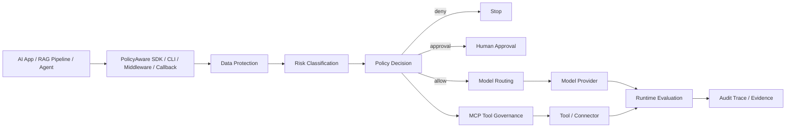

# PolicyAware AI Gateway & Agent Control Plane

PyPI: [policyaware](https://pypi.org/project/policyaware/) |
Downloads: [Pepy stats](https://pepy.tech/project/policyaware) |
Python: 3.10+ |
License: [Apache-2.0](https://github.com/ktirupati/policyaware/blob/main/LICENSE) |
Docs: [GitHub Pages](https://ktirupati.github.io/policyaware/)

PolicyAware adds deny-by-default policy, PII redaction, MCP tool governance, model routing, runtime evaluation, local code scanning, and audit traces to LLM, RAG, and AI agent applications in minutes.

PolicyAware is an open-source AI control plane and security gateway for governed LLM applications, RAG pipelines, MCP-style tools, and autonomous AI agents. Distributed as a lightweight Python package (`pip install policyaware`), it helps teams inspect prompts, request context, tool calls, model routing decisions, outputs, local code, and audit traces before AI workflows move into production.

Unlike basic content filters that only check text strings, PolicyAware provides policy-aware governance across requests, tools, models, evaluations, and local code scans.

Documentation site: https://ktirupati.github.io/policyaware/

Capability docs: [docs/capabilities.md](https://github.com/ktirupati/policyaware/blob/main/docs/capabilities.md)
Ready-to-use YAML policies: [docs/capabilities/ready-to-use-yaml.md](https://github.com/ktirupati/policyaware/blob/main/docs/capabilities/ready-to-use-yaml.md)
Comparison guide: [PolicyAware vs guardrails vs AI gateway vs model router](https://github.com/ktirupati/policyaware/blob/main/docs/comparison.md)
Alternatives guide: [PolicyAware alternatives for guardrails, AI gateways, model routers, and MCP governance](https://ktirupati.github.io/policyaware/alternatives.html)
Usage modes: [Gateway vs callbacks vs tool governance vs scan](https://github.com/ktirupati/policyaware/blob/main/docs/usage-modes.md)
Enterprise readiness: [enterprise AI governance checklist](https://github.com/ktirupati/policyaware/blob/main/docs/enterprise-readiness.md)
Limitations: [current scope and production validation notes](https://github.com/ktirupati/policyaware/blob/main/docs/limitations.md)
Security model: [deny-by-default and layered AI governance](https://github.com/ktirupati/policyaware/blob/main/docs/security-model.md)
Examples matrix: [choose the right runnable example](https://github.com/ktirupati/policyaware/blob/main/docs/examples-matrix.md)
Compatibility: [Python, providers, extras, and integration status](https://github.com/ktirupati/policyaware/blob/main/docs/compatibility.md)
Demo outputs: [captured terminal output for runnable examples](https://github.com/ktirupati/policyaware/blob/main/docs/demo-outputs.md)
Changelog: [release history](https://github.com/ktirupati/policyaware/blob/main/CHANGELOG.md)

## Enterprise Core Capabilities

### 1. Agent Control Plane And MCP Governance

- **Action-level tool governance:** Evaluates connector names, action names, arguments, user role, tenant, region, and approval requirements before agent tools execute.
- **Deny-by-default tool shielding:** Supports MCP-style tool policies that block unauthorized or destructive actions unless explicitly allowed.

### 2. Multi-Engine Security And Guardrail Orchestration

- **Unified governance pipeline:** Combines data protection, YAML policy enforcement, risk classification, model routing, guardrail adapters, evaluation, and audit logging in one modular Python framework.
- **Optional security integrations:** Supports optional integrations such as Microsoft Presidio for stronger PII detection, ProtectAI/Transformers-based classifiers for ML signals, NVIDIA NeMo Guardrails, and Guardrails AI adapters.

### 3. Cost-Aware Runtime Routing And FinOps Controls

- **Policy-based model routing:** Routes requests across local and external model providers based on task type, risk level, region, provider availability, cost, quality, and policy constraints.
- **Token and budget controls:** Supports token, budget, and risk-aware limits to help reduce runaway agent loops and uncontrolled model usage.

### 4. Observability, Audit, And Local Code Scanning

- **Audit-ready traces:** Records structured policy decisions, risk tiers, reason codes, model choices, evaluation scores, token estimates, and request/response snapshots.
- **Observability exporters:** Provides Prometheus-style and OpenTelemetry-shaped exports for integration with monitoring and compliance workflows.
- **PolicyAware Scan CLI:** Scans local codebases for PII, PHI, secrets, direct LLM calls, missing tool governance, weak routing controls, audit gaps, and configuration risks, then generates developer-friendly HTML, JSON, SARIF, and Markdown reports.
- **Framework callbacks:** Includes lightweight LangChain and LlamaIndex callback handlers that aggregate streamed tokens and report policy, risk, leakage, eval, and token-accounting results.

## Runtime Flow Summary



Read more: [Architecture](https://github.com/ktirupati/policyaware/blob/main/docs/architecture.md)

## Which Entry Point Should I Use?

| Need | Use |
| --- | --- |
| Full model request control, routing, eval, and audit | `Gateway.chat(...)` |
| Existing LangChain or LlamaIndex pipeline telemetry | `PolicyAwareCallbackHandler` |
| MCP-style connector/action permissions | `ToolPolicyEngine` |
| Pre-deployment code governance scan | `policyaware scan ./app` |
| Simple PII/PHI/secrets string check | `DataProtectionEngine.inspect(...)` |
| YAML policy unit testing | `PolicyEngine.decide(...)` |

Read more: [Usage Modes](https://github.com/ktirupati/policyaware/blob/main/docs/usage-modes.md)

## Scan Report Preview


## Author

Created and maintained by **Krishna Kishor Tirupati**.

Project links:

- PyPI: [policyaware](https://pypi.org/project/policyaware/)
- GitHub: [ktirupati/policyaware](https://github.com/ktirupati/policyaware)
- Documentation: [PolicyAware AI Gateway Docs](https://ktirupati.github.io/policyaware/)
- LinkedIn: [Krishna Tirupati](https://www.linkedin.com/in/krishna-tirupati/)

## Feedback And Testimonials

Using PolicyAware in a project, prototype, enterprise AI workflow, security review, or governance evaluation?

Please share feedback, use cases, feature requests, and testimonials through the channels below:

- Private structured feedback form: [PolicyAware User Feedback And Testimonials](https://docs.google.com/forms/d/e/1FAIpQLSc2QcQydjXZ0YF9bbVSpudoM5y8noxIP5jU-acVmjlyvf6Slg/viewform)
- Public discussions: [GitHub Discussions](https://github.com/ktirupati/policyaware/discussions)
- Testimonials and user stories: [Show and Tell](https://github.com/ktirupati/policyaware/discussions/categories/show-and-tell)
- Issues and bugs: [GitHub Issues](https://github.com/ktirupati/policyaware/issues)

Helpful feedback includes what you built, which PolicyAware feature you used, what risk or governance gap it helped identify, and what should improve next.

Please do not share secrets, private prompts, PHI, PII, customer data, or confidential internal details.

## Contributing And Roadmap

PolicyAware welcomes focused contributions from developers, AI platform engineers, security engineers, and governance practitioners.

- Contributing guide: [CONTRIBUTING.md](https://github.com/ktirupati/policyaware/blob/main/CONTRIBUTING.md)
- Roadmap: [ROADMAP.md](https://github.com/ktirupati/policyaware/blob/main/ROADMAP.md)
- Good first issues: [GOOD_FIRST_ISSUES.md](https://github.com/ktirupati/policyaware/blob/main/GOOD_FIRST_ISSUES.md)
- Security policy: [SECURITY.md](https://github.com/ktirupati/policyaware/blob/main/SECURITY.md)
- Adoption and impact tracking: [ADOPTION.md](https://github.com/ktirupati/policyaware/blob/main/ADOPTION.md)
- Curated testimonials: [TESTIMONIALS.md](https://github.com/ktirupati/policyaware/blob/main/TESTIMONIALS.md)

## Quick Start

```bash
pip install policyaware
policyaware about
policyaware feedback
policyaware init
policyaware policy validate policyaware.yaml
policyaware dev simulate
policyaware risk classify "Email jane@example.com about a patient diagnosis" --domain healthcare
policyaware scan ./mylocalfolder
policyaware scan ./mylocalfolder --json policyaware-scan-report.json --fail-on high
policyaware scan ./mylocalfolder --sarif policyaware.sarif
policyaware scan ./mylocalfolder --markdown policyaware-scan-report.md
policyaware scan ./mylocalfolder --baseline policyaware-baseline.json
policyaware scan ./mylocalfolder --config examples/policyaware-scan.yaml
policyaware scan ./mylocalfolder --diff --diff-base origin/main
policyaware scan ./mylocalfolder --format html,json,sarif,markdown
policyaware guards list examples/full-stack-guardrails/policy.yaml
```

## Installation Profiles

The default install is intentionally lightweight. It includes the core CLI, local scanner, policy engine, routing abstractions, cost/risk governance primitives, audit/eval contracts, and YAML policy support.

```bash
pip install policyaware
```

Install optional integrations only when you need them:

```bash
pip install "policyaware[privacy]"     # Presidio + spaCy privacy detection
pip install "policyaware[guardrails]"  # NeMo Guardrails + Guardrails AI
pip install "policyaware[providers]"   # Provider extras such as Bedrock boto3
pip install "policyaware[ml]"          # Transformers/Torch classifiers
pip install "policyaware[onnx]"        # ONNX runtime path for supported classifiers
pip install "policyaware[all]"         # All optional integrations
```

Backward-compatible aliases are also available:

```bash
pip install "policyaware[presidio]"
pip install "policyaware[nemo]"
pip install "policyaware[guardrails-ai]"
pip install "policyaware[full]"
```

For local development from this repository:

```bash
pip install -e ".[dev]"
policyaware policy test examples/policies/basic.yaml
policyaware policy validate examples/policies/basic.yaml
policyaware risk classify "Summarize this patient diagnosis" --domain healthcare
policyaware tools check examples/policies/tool-governance.yaml --agent code_assistant --connector github --action create_pr
policyaware eval run examples/evals/support_rag.yaml
policyaware scan . --out policyaware-scan-report.html
policyaware scan . --include ".py,.yaml,.json" --exclude "tests,fixtures"
policyaware scan . --write-baseline policyaware-baseline.json
policyaware scan . --config examples/policyaware-scan.yaml --format html,json,sarif,markdown
```

For copy-pasteable end-to-end examples, see [Working Examples](https://github.com/ktirupati/policyaware/blob/main/docs/working-examples.md).

Local code scan docs: [policyaware scan](https://github.com/ktirupati/policyaware/blob/main/docs/local-code-scan.md)

## Generate A Starter Policy

Create a NIST-aligned baseline starter policy in the current directory:

```bash
policyaware init
policyaware policy validate policyaware.yaml
```

Use a custom path or overwrite intentionally:

```bash
policyaware init --out config/policyaware.yaml
policyaware init --out policyaware.yaml --force
```

The generated template is deny-by-default and includes baseline rules for PII/PHI/secrets handling, risky MCP/tool command blocking, approval for side-effecting tool actions, token budget caps, and high-iteration agent workflows.

## LangChain And LlamaIndex Callbacks

Use callbacks when you already have an LLM framework pipeline and want PolicyAware governance results without changing the model call.

```python
from policyaware.integrations.langchain import PolicyAwareCallbackHandler

policyaware_callback = PolicyAwareCallbackHandler(config="policyaware.yaml")

response = chain.invoke(
    {"question": "Summarize this customer ticket."},
    config={"callbacks": [policyaware_callback]},
)

result = policyaware_callback.last_result
print(result.policy_decision.decision)
print(result.risk.tier)
print(result.output_findings.contains_sensitive)
```

Streaming-friendly manual example:

```python
from policyaware.integrations.langchain import PolicyAwareCallbackHandler

handler = PolicyAwareCallbackHandler(config="policyaware.yaml")
handler.on_llm_start(prompts=["Email jane@example.com with the ticket summary."])

for token in ["Safe ", "summary ", "without ", "private ", "data."]:
    handler.on_llm_new_token(token)

result = handler.on_llm_end()
print(result.to_dict())
```

LlamaIndex-style callbacks are also available:

```python
from policyaware.integrations.llamaindex import PolicyAwareCallbackHandler

handler = PolicyAwareCallbackHandler(config="policyaware.yaml")
handler.on_event_start(payload={"query_str": "Answer with citations from policy documents."})
handler.on_llm_new_token("The policy requires citation review [doc-1].")
result = handler.on_event_end(payload={})
```

More details: [LangChain and LlamaIndex callback integrations](https://github.com/ktirupati/policyaware/blob/main/docs/capabilities/integration-callbacks.md)

## Copy-Paste Examples

- [FastAPI LLM policy middleware](https://github.com/ktirupati/policyaware/tree/main/examples/fastapi-llm-policy-middleware): protect a FastAPI `/chat` endpoint with policy checks before model execution.
- [LangChain policy guardrails](https://github.com/ktirupati/policyaware/tree/main/examples/langchain-policy-guardrails): wrap a chain-style LLM call with deny-by-default policy, PII redaction, and secret blocking.
- [MCP tool permission gateway](https://github.com/ktirupati/policyaware/tree/main/examples/mcp-tool-permission-gateway): govern connector-level and action-level tool permissions for agent workflows.
- [PII redaction policy](https://github.com/ktirupati/policyaware/tree/main/examples/pii-redaction-policy): inspect and redact sensitive text before model execution.
- [Regulated RAG assistant](https://github.com/ktirupati/policyaware/tree/main/examples/regulated-rag-assistant): require citations and stricter controls for healthcare-style RAG.
- [Provider routing by risk](https://github.com/ktirupati/policyaware/tree/main/examples/provider-routing-by-risk): route public-safe requests to low-cost models and high-risk requests to approved models.
- [Audit trace viewer](https://github.com/ktirupati/policyaware/tree/main/examples/audit-trace-viewer): write audit traces and generate a local HTML trace viewer.
- [Approval workflow hooks](https://github.com/ktirupati/policyaware/tree/main/examples/approval-workflow-hooks): send high-risk requests to approval instead of calling a model.
- [Local code scan](https://github.com/ktirupati/policyaware/blob/main/docs/local-code-scan.md): scan local AI app code and generate an HTML governance report.
- [Full-stack guardrails](https://github.com/ktirupati/policyaware/tree/main/examples/full-stack-guardrails): orchestrate NeMo Guardrails, Guardrails AI, or custom validators as input/output guards.

Captured terminal output for the runnable examples is available in [docs/demo-outputs.md](https://github.com/ktirupati/policyaware/blob/main/docs/demo-outputs.md).

## Articles

- [PolicyAware vs Guardrails vs AI Gateways vs Model Routers](https://dev.to/ktirupati/policyaware-vs-guardrails-vs-ai-gateways-vs-model-routers-the-comparison-every-ai-engineer-needs-289p)
- [Build a Policy-Aware AI Gateway in Python](https://dev.to/ktirupati/build-a-policy-aware-ai-gateway-in-python-data-protection-policy-enforcement-with-policyaware-462h)
- [Stop Shipping AI Features Without Guardrails](https://medium.com/@krishna.k.tirupati/stop-shipping-ai-features-without-guardrails-build-safer-ai-apps-with-policyaware-8bfd8509e4fb)

```python
from policyaware import Gateway, GatewayRequest

gateway = Gateway.from_policy_file("examples/policies/basic.yaml")

response = gateway.chat(
    GatewayRequest(
        tenant="acme",
        app="claims-assistant",
        user={"id": "u_123", "role": "claims_adjuster"},
        context={"region": "us", "task_type": "summarization", "risk": "low"},
        messages=[{"role": "user", "content": "Summarize claim ACME-42."}],
    )
)

print(response.content)
print(response.policy.decision)
print(response.policy.reason_codes)
print(response.trace_id)
```

## Architecture

```text
Application / Agent / RAG App
        |
        v
PolicyAware SDK / Middleware
        |
        v
Identity + Context Resolver
        |
        v
Policy Decision Engine -> Data Protection Engine -> Model Router -> Provider/Tool
        |
        v
Runtime Evaluation -> Audit Trace -> Response
```

## Repository Layout

```text
src/policyaware/
  audit.py              Request traces and audit export records
  cli.py                policyaware CLI
  data_protection.py    PII/PHI/secret detection and redaction
  evals.py              Offline and runtime evaluation primitives
  gateway.py            Main SDK facade
  models.py             Core typed contracts
  policy.py             Deny-by-default policy engine
  providers.py          Provider abstraction and local simulated provider
  routing.py            Policy-aware model routing
  integrations/         FastAPI, Flask, LangChain, LlamaIndex shims
examples/
  policies/
  evals/
tests/
```

## Policy Example

```yaml
id: basic_enterprise_policy
default: deny

rules:
  - name: allow_low_risk_support
    effect: allow
    when:
      user.role_in: ["support_agent", "claims_adjuster"]
      request.risk_in: ["low", "medium"]
      data.contains_secrets: false

  - name: redact_pii_for_non_privileged_users
    effect: transform
    action: redact
    when:
      data.contains_pii: true
      user.role_not_in: ["privacy_admin", "compliance_officer"]

  - name: require_approval_for_high_risk
    effect: require_approval
    when:
      request.risk: "high"
```

## Development Status

This is a production-grade starter framework: the core extension points and executable behavior are present, while provider integrations, enterprise identity adapters, dashboard UI, and long-term storage can be expanded by contributors.

## v0.2 MVP Capabilities

- Deterministic risk classification: low, medium, high, critical.
- Explainable policy decisions with reason codes and remediation.
- Replayable audit trace snapshots.
- Audit bundle generation.
- Tool governance policies for MCP-style connectors and actions.
- Governance-aware eval report schema.
- Provider adapters for OpenAI-compatible APIs, Azure OpenAI, Anthropic, Bedrock, Vertex AI, Ollama, and vLLM.
- Optional ML signal integrations for Presidio PII detection, ProtectAI prompt-injection detection, and custom Transformers domain/risk classifiers.
- Optional NeMo Guardrails and Guardrails AI adapters for full-stack guardrail orchestration.
- Fast local code scanner and HTML recommendation report.
- SQLite audit storage and static trace viewer.
- Prometheus text and OpenTelemetry-shaped JSON exporters.
- File and webhook approval hooks.
- Executable golden dataset policy checks.

## Third-Party ML Models

Optional ML integrations may download third-party models at runtime. PolicyAware does not bundle model weights. Review and accept the license or access terms for any model you configure, especially gated Hugging Face models.

## Recommended GitHub Topics

For discovery, use repository topics such as `llm`, `ai-gateway`, `llm-governance`, `guardrails`, `rag`, `mcp`, `ai-agents`, `pii-redaction`, `model-routing`, `audit`, `python`, and `open-source`.

## License

Apache-2.0
