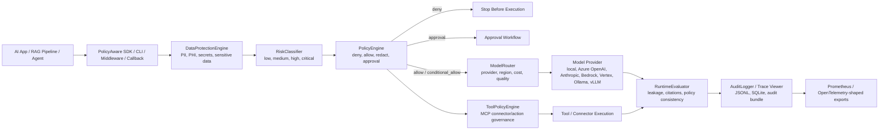

# Architecture

PolicyAware AI Gateway is organized around explicit, replaceable engines.

## Control Plane Diagram

## Entry Points

PolicyAware can be adopted at different layers:

| Entry Point | Best For | Controls Execution? |
| --- | --- | --- |
| `Gateway.chat(...)` | Central policy, routing, evaluation, and audit flow for LLM requests | Yes |
| FastAPI/Flask middleware | Protecting application endpoints before model calls | Application-controlled |
| LangChain/LlamaIndex callbacks | Observing existing framework pipelines, streamed tokens, and output checks | No, callback observes and reports |
| `ToolPolicyEngine` | MCP-style connector and action permissions | Yes, when called before tool execution |
| `policyaware scan` | Pre-deployment repository governance and compliance scanning | Static analysis only |
| `PolicyEngine` directly | Unit testing policy-as-code decisions | Policy decision only |

## Request Lifecycle

1. The SDK or middleware constructs a `GatewayRequest`.
2. `DataProtectionEngine` detects PII, PHI, secrets, and sensitive categories.
3. `RiskClassifier` assigns low, medium, high, or critical risk.
4. `PolicyEngine` evaluates deny, approval, allow, and transform rules with explainable reason codes.
5. Denied and approval-gated requests stop before model execution.
6. Allowed requests are transformed if required, then sent to `ModelRouter`.
7. `ModelProvider` executes the request against a local or external model.
8. `RuntimeEvaluator` scores the output for leakage, citations, policy consistency, and safety hooks.
9. `AuditLogger` writes a replay-ready trace.

## Extension Points

- `PolicyEngine`: replace YAML policies with OPA, Cedar, SQL-backed policies, or custom PDPs.
- `DataProtectionEngine`: add Microsoft Presidio, Cloud DLP, custom classifiers, or domain detectors.
- `ModelRouter`: add health checks, quality feedback, provider quotas, and SLO-aware routing.
- `ModelProvider`: implement OpenAI, Azure OpenAI, Bedrock, Vertex, Anthropic, vLLM, Ollama, or TGI adapters.
- `RuntimeEvaluator`: plug in LLM-as-judge, RAGAS-style scoring, citation validation, toxicity classifiers, and golden datasets.
- `AuditLogger`: write to OpenTelemetry, Kafka, SIEM, S3, BigQuery, Snowflake, or Postgres.
- `ToolPolicyEngine`: govern MCP-style connectors and action permissions.

## Policy Semantics

PolicyAware is deny-by-default.

Evaluation order:

1. `deny`
2. `require_approval`
3. `allow` plus any matching `transform`
4. default decision

Transform rules never grant access by themselves. They only modify requests that were otherwise allowed, or requests permitted by a default-allow policy.

## v0.2 Governance Additions

- Risk classification is deterministic and based on data sensitivity, domain, tool use, autonomy, business impact, and action type.
- Policy decisions include reason codes, matched policy IDs, violated policy IDs, and remediation guidance.
- Audit traces include request/response snapshots for replay and evidence bundles.
- Tool governance is separate from chat/model policy so agent actions can be authorized at connector and action level.
