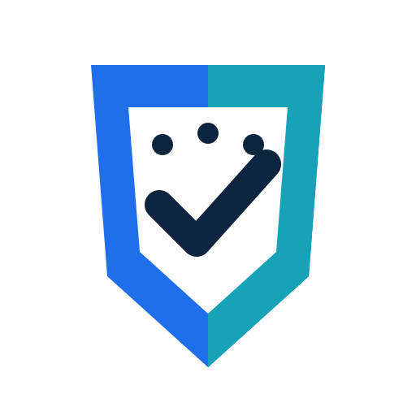

# PolicyAware Branding

PolicyAware should use a consistent icon and brand language across GitHub, PyPI, docs, Codex plugins, articles, screenshots, and future Antigravity or Claude workflow packs.

## Standard Icon



Use the standard PolicyAware shield/check icon for every PolicyAware surface from now on:

- GitHub repository visuals
- GitHub Pages documentation
- Codex, Antigravity, Claude, and other coding-agent plugins
- article cover images
- demo screenshots
- scan report branding
- presentation decks

## Brand Language

Preferred short positioning:

```text
PolicyAware is a Python AI firewall and policy-as-code control plane for LLM apps, RAG systems, MCP tools, and autonomous AI agents.
```

Preferred value proposition:

```text
Add deny-by-default policy, PII redaction, MCP/tool governance, model routing, evaluation, audit traces, and offline AI governance scanning to AI apps in minutes.
```

## Visual Guidance

| Element | Recommendation |
| --- | --- |
| Primary color | `#1F6FEB` |
| Accent color | `#16A3B8` |
| Dark text | `#0D253F` |
| Icon shape | Shield with check mark and policy nodes |
| Tone | Enterprise-ready, developer-friendly, governance-focused |

## Plugin Branding Checklist

Every PolicyAware plugin or coding-agent workflow pack, including Codex, Antigravity, Claude, Cursor, Windsurf, and future agent tooling, should include:

- PolicyAware display name
- standard icon
- short value proposition
- links to GitHub, PyPI, and docs
- first-run prompt that drives users to `policyaware scan`
- lightweight base install guidance
- optional dependency guidance for `privacy`, `ml`, and `guardrails`

Use the GitHub repository as the default website URL for plugin manifests:

```text
https://github.com/ktirupati/policyaware
```

Use the docs site as the documentation URL when a separate docs field is available:

```text
https://ktirupati.github.io/policyaware/
```

## Current Integration Packs

The repository includes starter packs that reuse this icon and positioning:

| Tool | Folder |
| --- | --- |
| Codex | `integrations/codex` |
| Antigravity | `integrations/antigravity` |
| Claude Code | `integrations/claude` |
| Cursor | `integrations/cursor` |
| Windsurf | `integrations/windsurf` |
