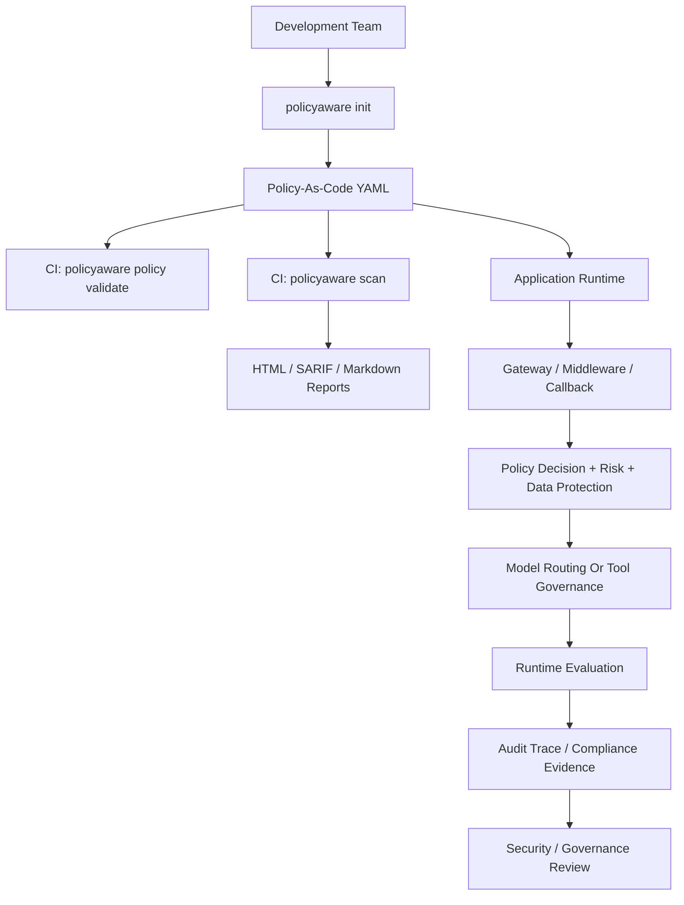

# Enterprise Readiness

PolicyAware is designed for enterprise AI teams that need governance controls across LLM apps, RAG pipelines, MCP-style tool use, autonomous agents, and local code review.

This page summarizes the features that help security, platform, compliance, and governance teams evaluate the framework.

PolicyAware is an open-source framework that enterprise teams can embed, extend, and operate as a policy-aware control plane inside their own AI applications and platform workflows. Teams can connect their preferred identity systems, storage retention model, approval workflows, dashboards, SIEM/GRC tools, and compliance review processes around PolicyAware controls.

## Readiness Checklist

| Area | PolicyAware Support |
| --- | --- |
| Policy-as-code | YAML policies with schema validation, deny-by-default behavior, rule matching, transforms, approval outcomes, and reason codes. |
| Data protection | PII, PHI, secrets, sensitive data detection, redaction actions, and optional Presidio-based privacy detection. |
| Risk classification | Deterministic risk tiering based on sensitivity, role, domain, tools, autonomy, action type, and business impact. |
| Agent/tool governance | MCP-style connector/action checks, role controls, approval flags, rate/budget metadata, and audit-ready decisions. |
| Model governance | Vendor-neutral routing abstractions and provider adapters for local and external model platforms. |
| Guardrail orchestration | Optional adapters for NeMo Guardrails, Guardrails AI, and custom input/output validators. |
| Runtime evaluation | Leakage checks, citation checks, policy consistency scoring, and golden dataset execution support. |
| Auditability | JSONL and SQLite audit storage, replay-ready traces, trace viewer, and audit bundle generation. |
| Observability | Live sidecar `/metrics`, Prometheus-style metrics, OpenTelemetry-shaped events, and audit-trace exports for monitoring workflows. |
| Local code governance | `policyaware scan` for repository-level governance and compliance findings with HTML, JSON, SARIF, and Markdown outputs. |
| Policy CI/CD | Official `ktirupati/policyaware-action` for GitHub pull-request scans, annotations, SARIF, and report artifacts, plus CLI commands for policy validation, composition checks, and contract drift detection. |
| Developer adoption | Python SDK, CLI, FastAPI/Flask shims, LangChain/LlamaIndex callbacks, copy-paste YAML policies, and runnable examples. |

## Enterprise Deployment Pattern

## Recommended Enterprise Controls

- Keep `default: deny` in production policies.
- Store policies in source control and review them like application code.
- Use separate policies for development, staging, regulated workloads, and production.
- Use `policyaware scan` in CI before release.
- Use the official [`ktirupati/policyaware-action`](https://github.com/ktirupati/policyaware-action) for GitHub pull-request checks.
- Run `policyaware policy validate`, `policyaware policy compose-check`, and `policyaware contract check` before publishing policy bundles.
- Export SARIF scan results to GitHub code scanning or compatible security tools.
- Scrape sidecar `/metrics` or export trace-derived metrics into Prometheus, Grafana, OpenTelemetry Collector, Datadog, SIEM, or GRC workflows.
- Use audit storage for production traces and evidence retention.
- Require approval for high-risk, regulated, destructive, or autonomous tool actions.
- Keep optional ML/guardrail integrations behind explicit extras so the base package remains lightweight.
- Live-test provider adapters in your own environment because cloud credentials, endpoints, and quotas are enterprise-specific.
- Benchmark latency in representative request paths, especially when optional ML classifiers or external guardrail engines are enabled.
- Decide whether PolicyAware audit traces are enough for your retention needs or whether they should be exported to enterprise storage, SIEM, or GRC systems.

## Evidence Artifacts

PolicyAware can generate or support the following review artifacts:

- policy decision reports
- audit traces
- trace viewer HTML
- audit bundles
- scan HTML reports
- scan SARIF reports
- eval reports
- YAML policy templates
- reason-code explanations
- GitHub Action annotations and CI artifacts

These artifacts help reviewers understand what was checked, which policy matched, what was blocked or transformed, and what remediation is recommended.

## Roles That Benefit

| Role | Value |
| --- | --- |
| AI platform engineers | Common control plane for model, RAG, agent, and tool workflows. |
| Security engineers | PII/secrets checks, tool shielding, scan reports, audit traces, and reason codes. |
| Compliance reviewers | Evidence bundles, policy reports, trace viewer, and governance summaries. |
| Application developers | Copy-paste SDK, CLI, callbacks, and middleware examples. |
| FinOps teams | Token, budget, model routing, and provider metadata controls. |
