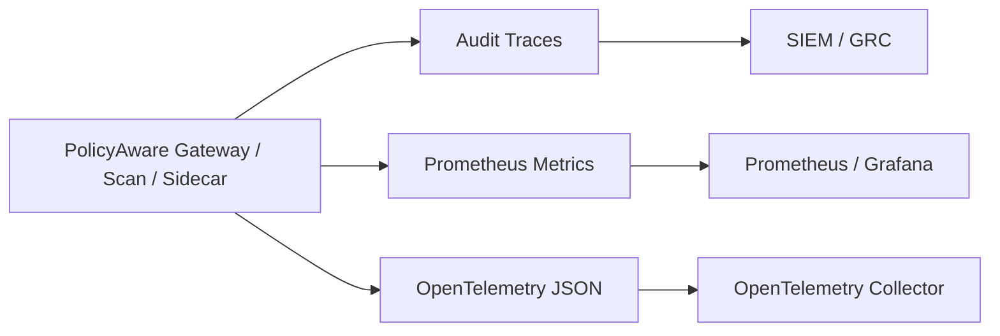

# Observability Templates

PolicyAware emits audit traces, HTML reports, JSON reports, SARIF, Markdown reports, Prometheus-style metrics, and OpenTelemetry-shaped JSON.

The repository includes templates that help teams connect PolicyAware evidence to existing dashboards and compliance systems.

## Template Files

```text
examples/observability/grafana-dashboard.json
examples/observability/otel-collector-config.yaml
examples/observability/prometheus-policyaware.yml
```

## Generate Local Metrics

```bash
policyaware observability prometheus .policyaware/traces.jsonl --out .policyaware/metrics.prom
policyaware observability otel-json .policyaware/traces.jsonl --out .policyaware/otel-spans.json
```

## Suggested Enterprise Pattern



## What To Dashboard

- policy decisions by allow/deny/approval/redact
- risk tier counts
- PII/PHI/secrets detections
- tool approvals and denials
- model/provider usage
- estimated cost
- scan findings by severity
- eval failures

PolicyAware does not force a single dashboard. It gives teams portable evidence that can be used with their existing observability, SIEM, and compliance tools.
